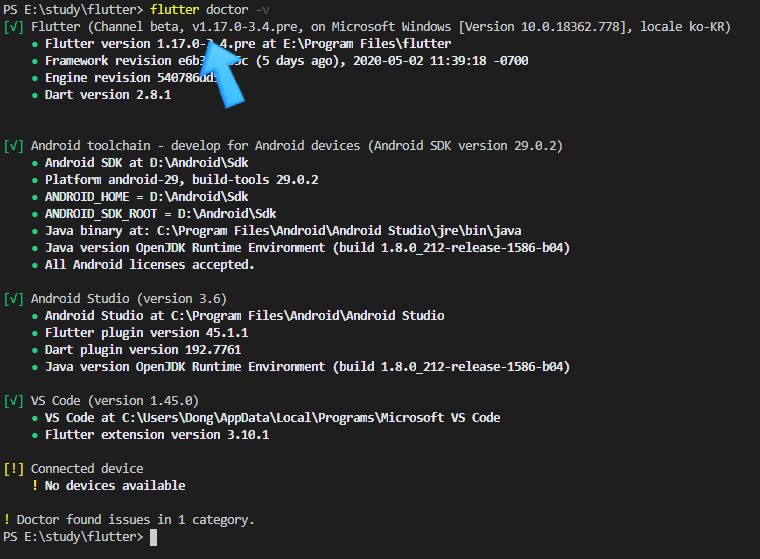
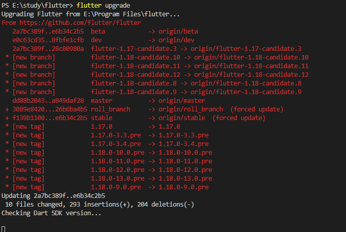
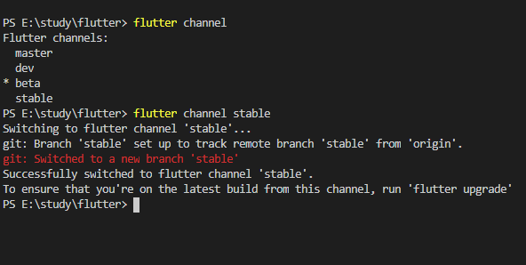
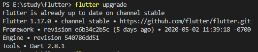
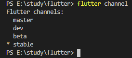
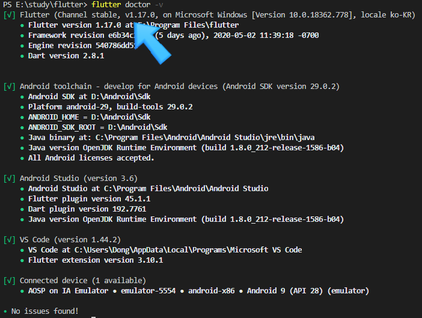

# 플러터(Flutter) - 최신 SDK로 업그레이드하기(ft. 1.17.0)

[https://flutter.dev/docs/development/tools/sdk/release-notes/changelogs/changelog-1.17.0](https://flutter.dev/docs/development/tools/sdk/release-notes/changelogs/changelog-1.17.0)

최근(2020년 5월 6일) 플러터(flutter) 1.17.0 안정된(stable) 버전이 출시되었다.

1.17.0에서는 상당히 많은 부분의 버그를 개선하였고 iOS의 성능을 끌어올렸으며 삼성 키보드 이슈도 개선하였다고 한다.

아래는 1.17.0과 관련된 포스팅이다. - 영어지만 구글 번역기로 충분히 읽을 수 있다.

[https://medium.com/flutter/announcing-flutter-1-17-4182d8af7f8e](https://medium.com/flutter/announcing-flutter-1-17-4182d8af7f8e)

이러한 이유로 1.17.0으로 업그레이드해보려 한다.

지금부터 실행되는 모든 명령들은 명령 프롬프트 또는 파워 쉘 등과 같은 터미널 입력창에서 진행해야 한다.

​

​

## 1. 버전 설치 확인

​

아래의 명령으로 현재 설치되어 있는 SDK 버전을 확인한다.

```


> flutter doctor -v


```




잉..?? v1.17.0-3.4.pre ... 이미 1.17.0 인가?? 

그건 아니고 그 뒤에 붙은 pre는 베타버전이라는 뜻이다.

버전 앞에 Channel Beta도 같은 의미이다.

beta 버전을 stable(안정된) 버전으로 변경하는 것은 업그레이드 이후에 해도 된다. 

​

​

## 2. SDK 업그레이드하기

SDK 업그레이드는 상당히 간단한다. 이렇게 하면 최신 버전으로 업그레이드를 진행한다.

```


> flutter upgrade


```




업그레이드는 잘 마무리된 것 같은데 역시나 채널(channel)이 beta로 설정되어 있었다.

음... 이것부터 처리를 해보자.

​

​

## 3. 안정된(Stable) 채널(channel)로 변경

만약 자신은 Channel Stable, v1.17.0 ...으로 표시된다면 여기는 패스해도 좋을 것 같다.

​

플러터 SDK는 채널(Channel)이라는 명칭으로 총 4 가지의 출시 버전(Release Version)을 관리하고 있다. 

채널이란 git에서 사용하는 branch 정도로 이해하면 될 것 같다.

master, dev, beta, stable

플러터 문서에서는 최신 릴리스가 필요한 게 아니라면 "stable"을 사용하는 것을 추천하고 있다.

​

현재 채널의 확인 및 stable(안정된 버전)로 변경은 다음 명령으로 가능하다.

```


> flutter channel         # 확인
> flutter channel stable  # stable로 변경


```




기존 채널이 beta로 되어 있었고 stable로 변경했다. 그리고 채널의 최신 빌드를 사용하려면 'flutter upgrade'를 실행하라고 한다.




음... 역시 이미 업그레이드가 되었기 때문에 별다른 것이 없었다.

다시 채널이 제대로 변경되었는지도 확인한다.




## ​

## 4. 최종 버전 확인

마지막으로 실제 1.17.0이 설치되어 있는지도 확인한다.

```


> flutter doctor -v


```




[sticker]

​

